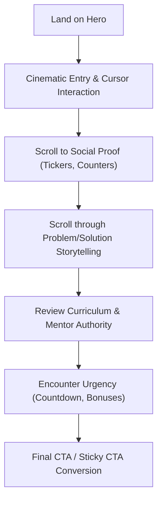

## 1. Product Overview
An ultra-premium, high-converting luxury landing page designed to rival top-tier tech brands (Apple, Stripe, Linear). 
- Designed for maximum conversion rate optimization (CRO) while delivering an unforgettable visual experience.
- Target audience expects authority, exclusivity, and institutional-grade trust.

## 2. Core Features

### 2.1 Feature Module
1. **Hero Section**: Animated background, gradient lights, spotlight following cursor, premium countdown, glass card, animated headline.
2. **Social Proof Section**: Video cards, revenue cards, animated graphs, live metrics, client logos ticker.
3. **Problem Section**: Interactive timeline, before vs after, scroll storytelling.
4. **Solution Section**: Interactive cards with hover expansion, glass cards, animated icons.
5. **What You Will Learn Section**: Accordion cards, progress indicators, animated checkmarks.
6. **Mentor Section**: Luxury profile card, animated portrait, experience timeline.
7. **Session Breakdown**: Interactive timeline, lesson cards, hover previews.
8. **Bonuses**: Premium cards, hover tilt, stacked card animation.
9. **Countdown & Final CTA**: Luxury countdown, animated background, trust badges, guarantee, floating effects.
10. **Footer**: Minimal, luxury, animated divider.

### 2.2 Page Details
| Page Name | Module Name | Feature description |
|-----------|-------------|---------------------|
| Landing Page | Hero | Initial hook with massive impact. Cinematic entry, particle effects, cursor spotlight. |
| Landing Page | Social Proof | Trust-building via dynamic data. Moving tickers, animated counters, live metrics. |
| Landing Page | Problem & Solution | Storytelling via scroll. Timeline reveals, interactive glassmorphism cards. |
| Landing Page | Curriculum & Mentor | Detail authority. Animated accordions, timeline of mentor achievements. |
| Landing Page | Conversion Elements | Sticky CTA, exit intent modal, floating CTA, countdown timers for urgency. |

## 3. Core Process
Users land on the page, experience a visually stunning cinematic hero section, scroll through a highly persuasive narrative built with micro-animations and scroll-triggered reveals, and are driven toward high-conversion CTA zones utilizing urgency and social proof.

## 4. User Interface Design

### 4.1 Design Style
- **Aesthetic**: Silicon Valley Fintech luxury (Apple, Tesla, Stripe, Linear). Minimalist yet high-end and expensive.
- **Color Palette**: Dark mode dominant (deep blacks, off-blacks) with vibrant gradient accents (e.g., ethereal blues, purples, or gold) for glow and spotlight effects.
- **Typography**: Large bold headlines. A luxury serif mixed with a modern sans-serif. Excellent hierarchy, huge spacing.
- **Components**: Glassmorphism, premium shadows, animated borders, magnetic buttons, hover glow, grain overlays.
- **Motion**: Ultra smooth. Micro animations everywhere. Never static.

### 4.2 Page Design Overview
| Page Name | Module Name | UI Elements |
|-----------|-------------|-------------|
| Landing Page | Global | Smooth scrolling (Lenis), custom animated cursor, grain overlay, floating particles. |
| Landing Page | Buttons | Magnetic effect, hover lift, glow, shine animation, ripple. |
| Landing Page | Transitions | Fade, blur, slide, scale, parallax, mask reveals. |

### 4.3 Responsiveness
Desktop-first design with meticulous mobile adaptation. Animations will be optimized for performance on mobile devices to ensure fast loading and 60fps smoothness.
