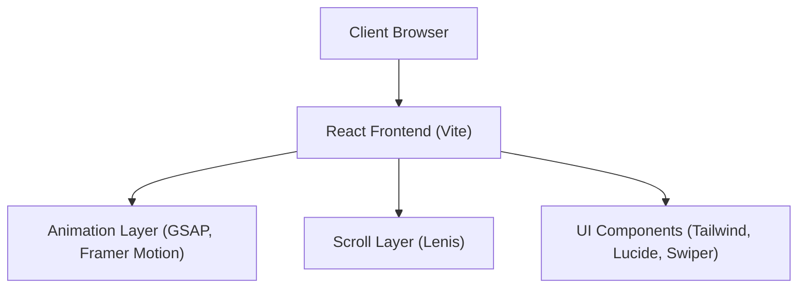

## 1. Architecture Design

## 2. Technology Description
- **Frontend Framework**: React.js (v18)
- **Build Tool**: Vite
- **Styling**: TailwindCSS (with clsx and tailwind-merge for dynamic classes)
- **Animation & Motion**: 
  - Framer Motion (Declarative animations, layout transitions)
  - GSAP (Complex timeline animations, scroll-triggered heavy lifting)
- **Scroll Hijacking/Smoothing**: React Lenis
- **Utilities & Effects**: 
  - React CountUp (for live metrics)
  - React Intersection Observer (for scroll reveals)
  - React Parallax Tilt (for 3D card tilt effects)
  - Swiper.js (for carousels/sliders)
  - Lucide Icons (Premium minimal icons)
  - Lottie (for complex vector animations)

## 3. Route Definitions
| Route | Purpose |
|-------|---------|
| `/` | The single ultra-premium landing page funnel |

## 4. Performance Optimization Architecture
- **Lazy Loading**: Non-critical sections (e.g., lower funnel modules, Lottie animations) will be dynamically imported to reduce initial bundle size.
- **Image Optimization**: WebP/AVIF formats, properly sized and lazy-loaded.
- **Animation Performance**: Prefer CSS transforms/opacity for hardware acceleration; use `will-change` appropriately; pause off-screen animations.
- **Code Splitting**: Leveraging Vite's automatic chunking for vendor libraries.
